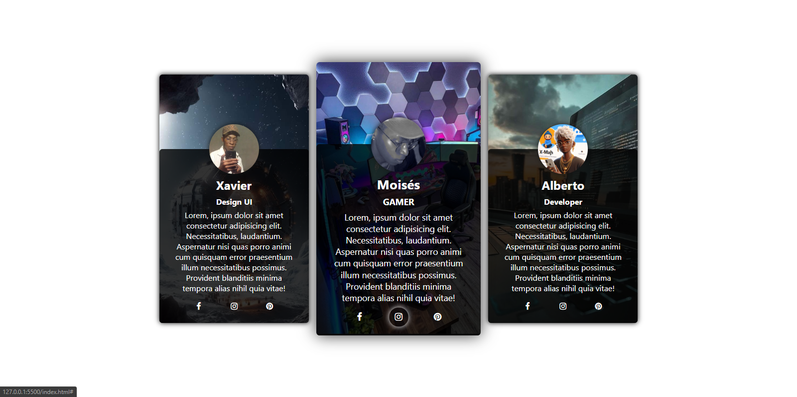

# CardCSS - Design de Cartões Responsivos com CSS Puro



## Sobre o Projeto

O **CardCSS** é um projeto que faz parte de um tutorial disponível no meu canal [Code X](https://www.youtube.com/channel/UCSeuCanal). Neste tutorial, ensino passo a passo como criar cartões de perfil responsivos utilizando apenas HTML e CSS puro, sem a necessidade de bibliotecas externas.
### Acessa
   LINK: https://xmaj2001.github.io/cardss/
## Funcionalidades

- Design moderno e responsivo
- Layout flexível com `flexbox`
- Fácil customização de cores e imagens
- Ícones sociais integrados

## Pré-requisitos

Antes de começar, você precisará ter os seguintes itens instalados na sua máquina:

- [Visual Studio Code](https://code.visualstudio.com/) ou qualquer outro editor de código de sua preferência
- Navegador de sua escolha (Chrome, Firefox, etc.)

## Como Usar

1. Clone o repositório:

   ```bash
   git clone https://github.com/xmaj2001/cardcss.git


